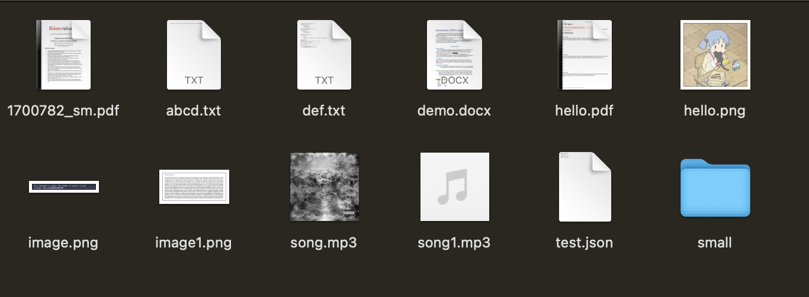

# NomNom 

<div style="display: flex; justify-content: center; gap: 2rem; padding: 1rem;">
  <div style="flex: 1; max-width: 600px;">
    <p> A powerful Go CLI tool for bulk renaming files using AI. NomNom helps you intelligently rename multiple files at once by analyzing their content and generating meaningful names using state-of-the-art AI models.
    </p>
  </div>
    

</div>

## Images
<div style="display: flex; flex-direction: column; align-items: center; gap: 2rem;">
  
    <h2> Before </h2>
    
    <h2> After </h2>
    
</div>


## Features ✨

- 🗂️ **Bulk Processing**: Rename entire folders of files in one go
- 🚀 **Parallel Processing**: Process multiple files simultaneously using parallel AI inference 
- 📂 **Reorganize** : Automaticlaly reorganize the renamed files into category folders
- 📄 **Smart Content Analysis**: Supports various file types including:
  - Text files
  - Documents (PDF, DOCX) - First 2 pages analyzed for context
  - Presentations
  - Images (metadata and OCR text extraction)
  - Videos (metadata)
- 🤖 **AI-Powered**: Multiple AI provider options:
  - DeepSeek V3/R1 model
  - OpenRouter support (access to Claude, GPT-4, and more)
  - Local execution via Ollama
- 👀 **Preview Mode**: Review generated names before applying changes
- 🎯 **Flexible Naming**: Supports different casing options (snake_case, camelCase, kebab, pascal.)
- 🔒 **Safe Operations**: Creates a separate directory for renamed files
  - Automatic handling of duplicate file names with incremental suffixes
  - Interactive approval process with "approve all" option
- 📝 **Operation Logging**: Detailed logs of all rename operations with:
  - Full absolute paths for reliable tracking
  - Original and new file locations
  - Operation timestamps and status
  - Support for reverting changes
  - Detailed error information and processing statistics
- ↩️ **Revert Support**: Ability to undo rename operations using logged history

### Parallel Processing 🔄

NomNom uses parallel processing for both AI operations and file handling:

- **Parallel AI Inference**: 
  - Processes multiple files simultaneously through AI models
  - Smart resource management for concurrent AI requests
  - Configurable retry mechanisms for failed requests
  - Automatic batch processing of files

- **Parallel File Processing**:
  - Concurrent file reading and content extraction
  - Worker pool-based processing for efficient I/O operations
  - Safe file operations with semaphore-based concurrency control
  - Automatic file size validation and filtering

- **Configurable Settings**:
  ```json
  {
    "performance": {
      "ai": {
        "workers": 5,        // Number of concurrent AI workers
        "timeout": "30s",    // AI operation timeout
        "retries": 1        // Number of retries for failed AI requests
      },
      "file": {
        "workers": 5,        // Number of concurrent file workers
        "timeout": "30s",    // File operation timeout
        "retries": 1        // Number of retries for failed file operations
      }
    }
  }
  ```


> **Note**: The parallel processing system is designed to be efficient while preventing system overload. The number of workers and timeouts can be adjusted based on your system's capabilities and requirements.

### File Name Validation

NomNom includes comprehensive file name validation to ensure safe and compatible renaming:

- Checks for invalid characters in file names
- Validates against Windows reserved names
- Enforces path length limits
- Removes leading/trailing spaces and periods
- Handles duplicate file names with incremental suffixes

Note: All the validation is done in `internal/files/validation.go`.

### Things to know
- You necessarily don't need put your API keys in the config file. If you leave `api-key=""`, and export your API keys as the following, nomnom should pick it up:
  ```bash
  # For DeepSeek
  export DEEPSEEK_API_KEY="your-deepseek-api-key"

  # For OpenRouter
  export OPENROUTER_API_KEY="your-openrouter-api-key"
  ```

**NomNom will automatically detect and use these environment variables if no API keys are specified(but the providers are) in the config file.** 
If no provider is set, it will revert to deepseek and possibly use the `DEEPSEEK_API_KEY` env variable. 
## Installation

### Requirements
Install Tesseract OCR:
   - macOS: `brew install tesseract`
   - Ubuntu/Debian: `sudo apt-get install tesseract-ocr`
   - Windows: Download installer from [UB Mannheim](https://github.com/UB-Mannheim/tesseract/wiki)

### MacOS/Linux
Clone and install NomNom:

```bash
# Clone the repository
git clone https://github.com/vein05/nomnom.git
cd nomnom

# Make it executable
chmod +x ./nomnom

# Move binary to your PATH
sudo mv ./nomnom /usr/local/bin/

# Create config directory and copy default config(after adding your API Keys or making changes)
mkdir -p ~/.config/nomnom
cp config.example.json ~/.config/nomnom/config.json
```

### Windows

```
# Clone the repository
git clone https://github.com/vein05/nomnom.git
cd nomnom

# Create config directory in AppData\Roaming
New-Item -ItemType Directory -Path "$env:APPDATA\nomnom" -Force

# Copy the example config file
Copy-Item -Path "config.example.json" -Destination "$env:APPDATA\nomnom\config.json"

# Add nomnom.exe to PATH (Option 1: Use a custom tools directory)
New-Item -ItemType Directory -Path "$env:USERPROFILE\Tools" -Force
Copy-Item -Path "nomnom.exe" -Destination "$env:USERPROFILE\Tools"
[Environment]::SetEnvironmentVariable("PATH", "$env:PATH;$env:USERPROFILE\Tools", "User")

# Option 2: Use WindowsApps (requires admin rights)
# Copy-Item -Path "nomnom.exe" -Destination "$env:USERPROFILE\AppData\Local\Microsoft\WindowsApps"

```

## Quick Start 🚀

1. Create/Edit the config

1. Create/Edit the config file at `~/.config/nomnom/config.json`. See [config.example.json](config.example.json) for a complete example.

2. Run NomNom:
```bash
nomnom --dir /path/to/files
```

## Usage 📖

### Basic Command
```bash
nomnom --dir <directory> [flags]
```

### Available Flags

| Flag           | Short | Description                                     | Default |
|---------------|--------|------------------------------------------------|---------|
| --dir         | -d    | Source directory containing files to rename      | |
| --config      | -c    | Path to config file                             | ~/.config/nomnom/config.json |
| --auto-approve| -y    | Automatically approve changes                    | false |
| --dry-run     | -n    | Preview changes without renaming                | true |
| --log         | -l    | Enable operation logging                        | true |
| --organize    | -o    | Organize files into category folders            | true |
| --revert      | -r    | Revert changes from the log file               | OFF |

### Configuration

NomNom uses a JSON configuration file with the following options:

- **Output Settings**
  - `output`: Output directory path
  - `case`: Naming case style (snake, camel, etc.)

- **AI Settings**
  - Provider selection (DeepSeek/Ollama/OpenRouter)
  - Model configuration
  - API keys

- **File Handling**
  - File type inclusion/exclusion
  - Size limits
  - Backup options

- **Content Extraction**
  - Text extraction settings
  - Metadata processing
  - Content length limits

- **Performance**
  - Worker count
  - Timeout settings
  - Retry configuration

See the full configuration example in [config.example.json](config.example.json).

### AI Provider Examples

#### Using DeepSeek (Default)
```json
{
  "ai": {
    "provider": "deepseek",
    "model": "deepseek-v3",
    "api_key": "your-deepseek-api-key"
  }
}
```

#### Using OpenRouter
```json
{
  "ai": {
    "provider": "openrouter",
    "model": "anthropic/claude-3-opus-20240229",
    "api_key": "your-openrouter-api-key",
    "temperature": 0.7,
    "max_tokens": 100
  }
}
```

OpenRouter gives you access to various models including:
- `anthropic/claude-3-opus-20240229`
- `anthropic/claude-3-sonnet-20240229`
- `openai/gpt-4-turbo-preview`
- And many more! Check [OpenRouter's model list](https://openrouter.ai/docs#models) for all available options. I recommend using `google/gemini-2.0-flash-001`.

### File Organization 📂

NomNom can automatically organize files into categories based on their types:

- **Default Categories**:
  - Documents (pdf, docx, txt, etc.)
  - Images (png, jpg, etc.)
  - Audios (mp3, wav, etc.)
  - Videos (mp4, mov, etc.)
  - Others (uncategorized files)

- **Features**:
  - Automatic type detection
  - Maintains original file structure within categories
  - Safe file operations with duplicate handling
  - Optional - can be disabled with `--organize=false`


### Logging and Reverting

NomNom includes a robust logging system that tracks all file operations:

#### Logging Features
- Logs are stored in `.nomnom/logs` in your target directory
- Each session generates a unique log file (`changes_{timestamp}.json`)
- Logs contain detailed information about each operation:
  ```json
  {
    "session_id": "1234567890",
    "start_time": "2024-03-21T10:00:00Z",
    "end_time": "2024-03-21T10:01:00Z",
    "entries": [
      {
        "timestamp": "2024-03-21T10:00:30Z",
        "operation": "rename",
        "original_path": "/absolute/path/to/original/file.txt",
        "new_path": "/absolute/path/to/new/file.txt",
        "base_dir": "/absolute/path/to/original",
        "relative_path": "file.txt",
        "success": true
      }
    ]
  }
  ```

#### Revert Operations
The revert functionality allows you to restore files to their original names in a safe manner:

- Files are restored to a new directory: `nomnom/reverted/{session_id}`
- Original file structure is preserved
- Detailed logs of the revert operation are maintained

To revert changes:
```bash

# Log possible changes from a specific log file
nomnom --revert path/to/changes_timestamp.json

# Example:
nomnom  --revert .nomnom/logs/changes_20240321_100000.json

# Apply the revert
nomnom --revert .nomnom/logs/changes_20240321_100000.json --dry-run=false

```

The revert operation will:
1. Create a new directory for reverted files
2. Copy files with their original names
3. Maintain the original directory structure
4. Log all revert operations
5. Display progress and results in the terminal

Note: The revert operation is non-destructive - it creates copies of files rather than moving or deleting existing ones.

## Commands

<details open> 
 <summary>Basic nomnom execution (Preview Mode)</summary>

```bash 
nomnom -d "~/Documents/ResearchPapers/" 
```
</details>

<details> 
 <summary>Execute rename operation</summary>

```bash 
nomnom -d "~/Documents/ResearchPapers/" --dry-run=false
```
</details>

<details>
 <summary>Use custom config file</summary>

```bash
nomnom -d "~/Documents/ResearchPapers/" --config ~/.config/nomnom/custom-config.json
```
</details>

<details>
 <summary>Auto-approve all changes</summary>

```bash
nomnom -d "~/Documents/ResearchPapers/" --auto-approve=false --dry-run=false
```
</details>

<details>
 <summary>Disable logging</summary>

```bash
nomnom -d "~/Documents/ResearchPapers/" --log=false
```
</details>

<details>
 <summary>Using short flag notation</summary>

```bash
# Same as the basic execution but with short flags
nomnom -d "~/Documents/ResearchPapers/" -y -n=false
```
</details>

<details>
 <summary>Revert previous changes </summary>

```bash
nomnom --revert "demo/nomnom/logs/changes_1743284325.json"
# or
nomnom -r "demo/nomnom/logs/changes_1743284325.json"
```
</details>

## Contributing 

Contributions are welcome! Please feel free to submit a Pull Request.

## License 📄

This project is licensed under the MIT License - see the [LICENSE](LICENSE) file for details. 

### Content Extraction Settings
- `extract_text`: Enable text extraction from files
- `extract_metadata`: Enable metadata extraction
- `max_content_length`: Maximum content length to process (default: 5000 characters)
- `skip_large_files`: Skip processing of files larger than the specified size limit
- `read_context`: Enable reading file context for better naming

### Performance

NomNom includes comprehensive tests for all major components. To run the tests:

```bash
# Run all tests
go test ./...

# Run tests for specific package
go test ./internal/ai
go test ./internal/content
go test ./internal/files
```

#### Test Requirements
- DEEPSEEK_API_KEY environment variable for DeepSeek tests
- OPENROUTER_API_KEY environment variable for OpenRouter tests
- Ollama running locally for Ollama tests
- Tesseract OCR installed for image processing tests

#### Test Coverage
The test suite covers:
- AI model integration (DeepSeek, OpenRouter, Ollama)
- File processing and renaming operations
- Content extraction from various file types
- Safe mode operations
- Logging and revert functionality
- Configuration handling
- Error cases and edge conditions
